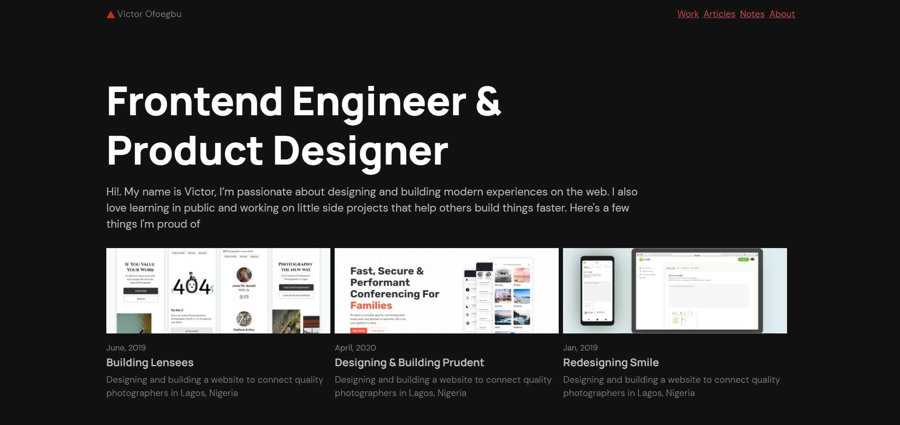

# 🦚 Next Starter Peacock

Peacock is a NextJS portfolio Starter for software engineers and designers. Showcase your awesome work and build personal sites you're proud of.

## Features

- Styled with EmotionJS💅🏾
- Written in TypeScript ⚛
- Blog, Notes and Work content types 🖊

## Getting Started

1. Fork the project. (It's highly recommended to fork the project to get upcoming features and bug fixes)

2. Clone your fork

```bash
git clone https://github.com/<your-username>/next-starter-peacock.git
```

3. Install the dependencies for `canvas` (see [Automattic/node-canvas#1065](https://github.com/Automattic/node-canvas/issues/1065)).

on macOS:

```bash
brew install pkg-config pixman cairo pango
```

on Windows:

```bash
choco install -y python visualstudio2017-workload-vctools gtk-runtime libjpeg-turbo gtk-runtime
npm config set msvs_version 2017
```

> NOTE: In case this command doesn't work, You may need the `cairo` library, which is bundled in GTK. Download the GTK 2 bundle for [Win32](http://ftp.gnome.org/pub/GNOME/binaries/win32/gtk+/2.24/gtk+-bundle_2.24.10-20120208_win32.zip) or [Win64](http://ftp.gnome.org/pub/GNOME/binaries/win64/gtk+/2.22/gtk+-bundle_2.22.1-20101229_win64.zip). Unzip the contents in `C:\GTK`
>
> You may also find more info about `canvas` windows manual installation in the [Wiki](https://github.com/Automattic/node-canvas/wiki/Installation:-Windows).

4. Jump into the directory and Install dependencies

```bash
cd next-starter-peacock && yarn

or

cd next-starter-peacock && npm install
```

5. Start the dev server

```bash
yarn dev

or

npm run dev
```

6. Find `config/index.json`, change `name` and `title` to your name and title. Save and open [http://localhost:3000](http://localhost:3000) with your browser 💥💥💥. See the results 😊.

---

## Customize Peacock

Peacock ships with 3 basic content types

- **Articles**: Long form content. Think blog posts 📚. All articles are in the `/content/articles` folder. Any markdown document you add here will show on the `/articles` page.
- **Notes**: Short form Spontaneous content 🖋. All notes are in the `/content/notes` folder.
- **Works**: Case studies and projects you want to show 🛠. All works are in the `/content/works` folder. There's a `selectedWork` field in the markdown meta. Setting it to `true` will display the case study/work on the `index.tsx` page.

## Deploy to Vercel

The easiest way to deploy your Next.js app is to use the [Vercel Platform](https://vercel.com/import?utm_medium=default-template&filter=next.js&utm_source=create-next-app&utm_campaign=create-next-app-readme) from the creators of Next.js.

Check out our [Next.js deployment documentation](https://nextjs.org/docs/deployment) for more details.

## Contributing

The best way you can contribute to peacock is by [creating issues](https://github.com/vickOnRails/next-starter-peacock/issues), reporting bugs and propose new features. If you're kind enough and have extra time, you can help on some features. Here's the simple workflow

- Open issue to see if the feature is already worked on
- Get go ahead to work on feature if it's not taken
- Fork `next-starter-peacock`
- Create your branch and do your magic
- Send pull request
- Pull request is merged

The fastest way to get an answer to your question is to reach out via [Twitter](https://twitter.com/vick_onrails). Feel free to through a tweet or DM.

## Todo

- [x] Test rendering and styling of standard HTML elements
- [x] Replace personal portfolio content with demo content
- [x] Add simpler notes page
- [x] Image optimization (Fixed image heights to avoid layout janks)
- [x] RSS Feed
- [ ] Release V1
- [ ] Add page transitions with `react-spring`
- [ ] Add mdx support
- [x] Code syntax highlighting
